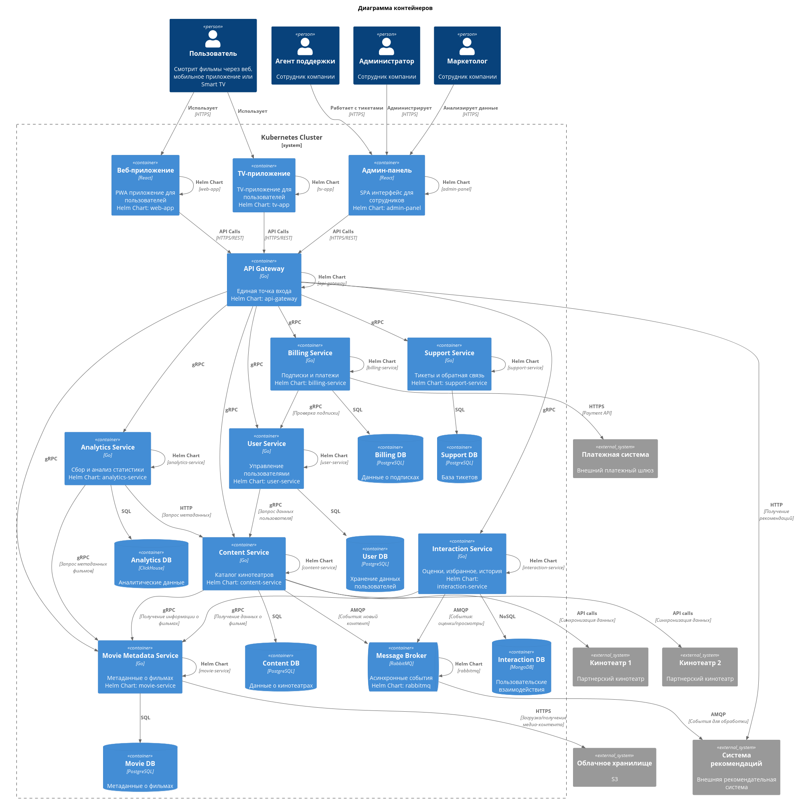
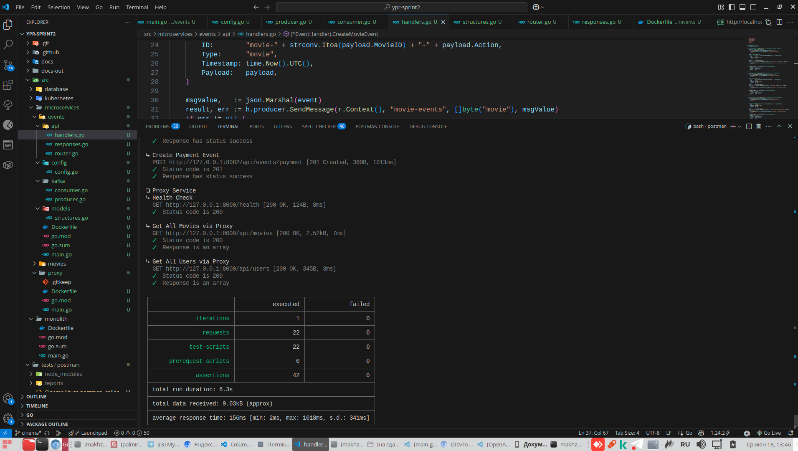
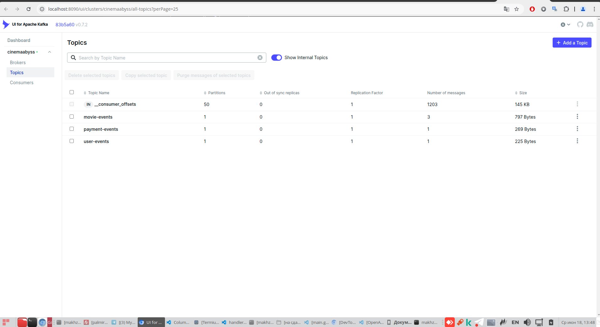
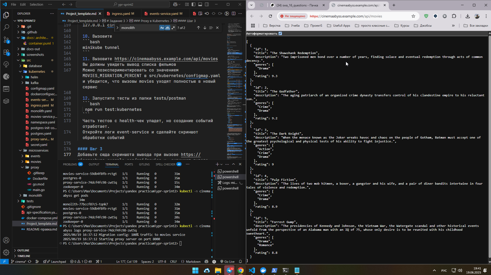
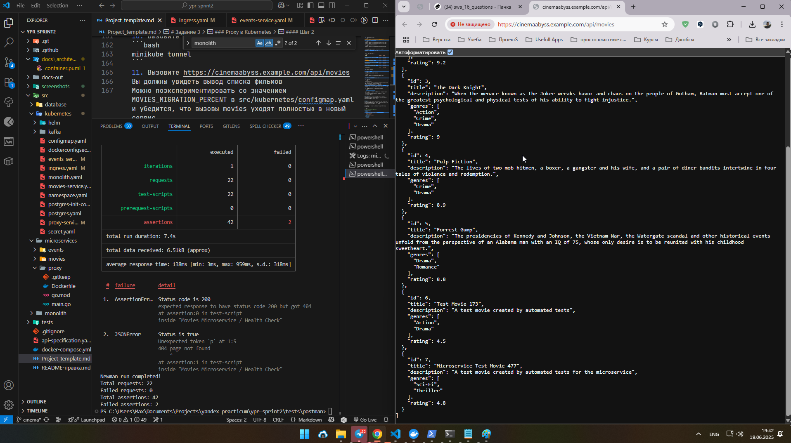
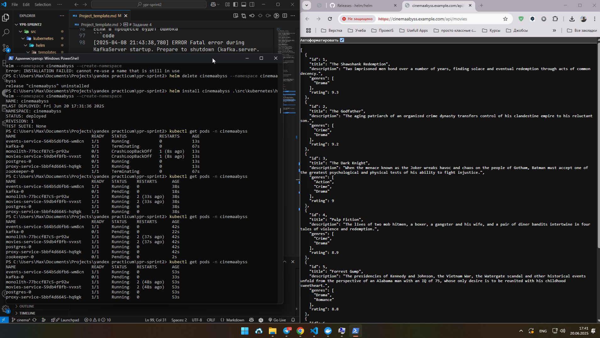

# Задание 1

#### To-Be:

- Домен "Онлайн-кинотеатр - агрегатор":

	- Поддомен "Управление пользователями"

		- Контекст: регистрация и аутентификация пользователей в системе, восстановление доступа
		- Контекст: авторизация пользователей

	- Поддомен "Управление контентом"

		- Контекст: интеграция с кинотеатрами
		- Контекст: каталог кинотеатров-партнеров

  - Поддомен "Метаданные о фильмах"

		- Контекст: хранение детальной информации о фильмах
		- Контекст: информация о жанрах, актерах, режиссерах
		- Контекст: управление медиа-контентом

	- Поддомен "Избранное и оценки"
	
		- Контекст: оценка фильмов
		- Контекст: управление избранным
		- Контекст: история просмотров

	- Поддомен "Управление подписками и платежами"
		
		- Контекст: интеграция с платежными системами
		- Контекст: просмотр и управление подписками

	- Поддомен "Поддержка и сопровождение"

		- Контекст: система тикетов, взаимодействие с пользователями экосистемы, помощь в подключении устройств
		- Контекст: получение обратной связи от пользователей экосистемы

	- Поддомен "Аналитика для маркетинга"

		- Контекст: сбор статистических данных (просмотры, клики, избранное)
		- Контекст: визуализация собранных данных с целью выявления наиболее популярных кинотеатров и контента среди пользователей

  
[Диаграмма контейнеров](./docs/architecture/container/container.puml)

# Задание 2

### 1. Proxy

Реализовано.

### 2. Kafka

Тесты 

Топики

# Задание 3

Вывод фильмов

Тесты 

# Задание 4

